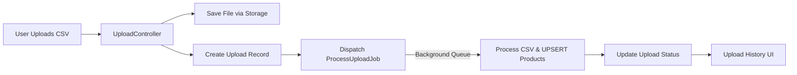

<p align="center"><a href="https://laravel.com" target="_blank"></a></p>

# 📦 Laravel CSV Upload & Background Processing System

A lightweight, asynchronous **CSV Upload Management System** built with **Laravel**, featuring background job queues, real-time upload tracking, and idempotent UPSERT data handling.


---

## 🚀 Features

-   ✅ **Drag & Drop CSV Upload**
-   ✅ **Background Job Processing (Queue)**
-   ✅ **UPSERT Logic (Idempotent Data Import)**
-   ✅ **Real-Time Upload Status (Polling)**
-   ✅ **Detailed Upload History**
-   ✅ **Clean UI with Bootstrap 5**
-   ✅ **Supports Large Files (streamed processing)**

---

## 🧠 System Overview

This project allows users to upload CSV files which are processed asynchronously.  
Each upload is tracked, parsed, and used to insert or update (`UPSERT`) product records in the database.  
Users can see real-time upload progress and maintain a complete history of all uploads.

### Data Flow



---

## 🧩 Project Structure

| Component                        | Description                                                   |
| -------------------------------- | ------------------------------------------------------------- |
| **UploadController**             | Handles uploads, stores files, and dispatches background jobs |
| **ProcessUploadJob**             | Background worker that parses and imports CSV data            |
| **Upload Model**                 | Stores file metadata, status, and stats                       |
| **Product Model**                | Stores imported CSV rows (with unique `UNIQUE_KEY`)           |
| **UploadResource (Transformer)** | Converts upload data into JSON for front-end polling          |
| **Blade View**                   | Clean UI with drag-and-drop uploader and live status updates  |
| **Queue Worker**                 | Executes background jobs (non-blocking uploads)               |

---

## 🗃️ Database Schema

### uploads table

Tracks all uploaded files.

| Column            | Description                              |
| ----------------- | ---------------------------------------- |
| `id`              | Primary key                              |
| `original_name`   | Uploaded filename                        |
| `stored_path`     | Storage path in `/storage/app/uploads/`  |
| `checksum_sha256` | File hash for idempotency                |
| `status`          | queued / processing / completed / failed |
| `rows_total`      | Rows read                                |
| `rows_upserted`   | Rows inserted or updated                 |
| `rows_failed`     | Rows skipped or invalid                  |
| `meta`            | JSON error or mapping data               |
| `timestamps`      | Laravel created_at, updated_at           |

### products table

Stores the parsed product data (UPSERT target).

| Column                   | Description                         |
| ------------------------ | ----------------------------------- |
| `unique_key`             | Unique identifier (used for UPSERT) |
| `product_title`          | Product name                        |
| `product_description`    | Description text                    |
| `style_no`               | Style number                        |
| `sanmar_mainframe_color` | Color reference                     |
| `size`                   | Product size                        |
| `color_name`             | Color display name                  |
| `piece_price`            | Decimal price                       |
| `timestamps`             | created_at, updated_at              |

---

## ⚙️ Installation & Setup

### 1️⃣ Clone the repository

```bash
git clone https://github.com/yourusername/laravel-csv-uploader.git
cd laravel-csv-uploader
```

### 2️⃣ Install dependencies

```bash
composer install
npm install && npm run build   # optional if you use Vite
```

### 3️⃣ Create `.env`

```bash
cp .env.example .env
```

Edit `.env` to use SQLite (for simplicity):

```env
DB_CONNECTION=sqlite
DB_DATABASE=/absolute/path/to/your/project/database/database.sqlite
QUEUE_CONNECTION=database
FILESYSTEM_DISK=local
```

### 4️⃣ Create database & run migrations

```bash
php artisan migrate
```

### 5️⃣ Start the server & queue worker

```bash
php artisan serve
php artisan queue:work --queue=uploads,default --memory=512
```

### 6️⃣ Visit in browser

> http://127.0.0.1:8000

---

## 🧮 CSV File Format

| Field                  | Description                                 |
| ---------------------- | ------------------------------------------- |
| UNIQUE_KEY             | Primary unique identifier (used for UPSERT) |
| PRODUCT_TITLE          | Product title                               |
| PRODUCT_DESCRIPTION    | Description text                            |
| STYLE#                 | Style number                                |
| SANMAR_MAINFRAME_COLOR | Color reference                             |
| SIZE                   | Product size                                |
| COLOR_NAME             | Color display name                          |
| PIECE_PRICE            | Decimal price                               |

Example CSV:

```csv
UNIQUE_KEY,PRODUCT_TITLE,PRODUCT_DESCRIPTION,STYLE#,SANMAR_MAINFRAME_COLOR,SIZE,COLOR_NAME,PIECE_PRICE
A100,Classic Tee,Soft cotton tee,ST-01,RED,M,Crimson,9.99
A101,Polo Shirt,Premium blend,ST-02,BLUE,L,Sky Blue,14.50
```

---

## 🔁 UPSERT Behavior (Idempotency)

The system uses `DB::table('products')->upsert()`:

-   If `UNIQUE_KEY` **exists**, update the row.
-   If not, **insert** a new one.

This ensures:

-   No duplicate products.
-   Re-uploading the same file just updates existing data.

---

## 🧵 Background Queue

All uploads are processed asynchronously.

```bash
php artisan queue:work --queue=uploads,default
```

This keeps uploads fast and responsive — even for large files.

---

## 💻 Front-End (Blade)

-   Uses **Bootstrap 5**
-   Features **drag & drop upload area**
-   Shows **uploading indicator**
-   Displays upload history with status badges
-   Polls backend `/uploads/poll` every 3s for updates

---

## 📄 Example Workflow

1️⃣ Drag & drop a CSV file into the drop zone  
2️⃣ The file is validated and queued for processing  
3️⃣ `ProcessUploadJob` reads and parses the file in the background  
4️⃣ Data is upserted into the `products` table  
5️⃣ The upload status updates in the browser automatically

---

## 🔍 Technologies Used

-   **Laravel 11.x**
-   **Bootstrap 5**
-   **Laravel Queues (database driver)**
-   **Laravel Storage (local disk)**
-   **League\CSV** for advanced CSV parsing
-   **SQLite / MySQL** for persistence

---

## 🧑‍💻 Developer Notes

-   Re-uploads with the same filename are allowed (no conflicts).
-   Each upload is timestamped and tracked individually.
-   Background jobs handle CSV parsing and UPSERT operations.
-   Upload status updates are fetched via polling (3s interval).
-   The design is responsive and user-friendly.

---

## 🧩 Possible Enhancements

-   [ ] Real-time WebSocket updates (Laravel Echo / Pusher)
-   [ ] Redis queue backend for performance
-   [ ] CSV validation rules (required columns, data types)
-   [ ] File storage on AWS S3 / Google Cloud
-   [ ] Multi-file batch uploads

---

<!-- ## 🧾 License

This project is open-source and available under the [MIT License](LICENSE).

--- -->

## 💬 Author

**Amir Nadzim Kaharudin**  
🎓 International Islamic University Malaysia — Bachelor of Information Technology (Information Assurance and Security)
💻 Full-stack Laravel / React Developer  
📧 [amirnadzim97@gmail.com](mailto:amirnadzim97@gmail.com)

> _“Asynchronous systems are not just faster — they make users happier.”_
